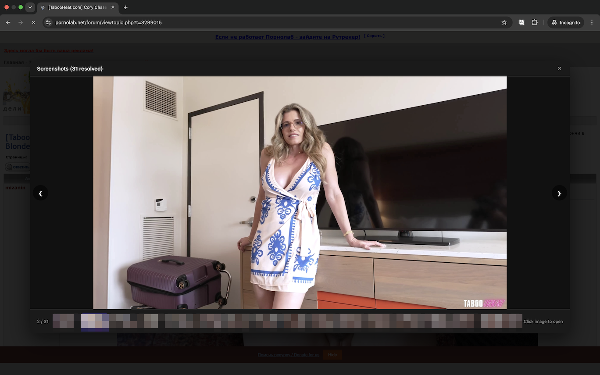

# PRNLB Viewer

A browser extension (Chrome & Firefox) that extracts image URLs from Pornolab topic pages and displays them in a carousel overlay.



## Development

### Prerequisites

- [Node.js](https://nodejs.org/) (v18+)
- npm

### Setup

```bash
npm install
```

### Build & Watch

```bash
# One-time build
npm run build

# Watch mode (auto-rebuild on changes)
npm run watch
```

This compiles TypeScript sources from `src/` into bundled JavaScript in `dist/`.

### Type checking

```bash
npx tsc --noEmit
```

## Install in Chrome

1. Build the project (`npm run build`)
2. Open Chrome and navigate to `chrome://extensions/`
3. Enable **Developer mode** (toggle in the top-right corner)
4. Click **Load unpacked**
5. Select the project root directory (`prnlb-extension/`)

The extension will appear in your toolbar. Navigate to a Pornolab topic page and click the icon to open the screenshot carousel.

After making changes, run `npm run build` again and click the **reload** button on the extension card in `chrome://extensions/`.

## Install in Firefox

1. Build the project (`npm run build`)
2. Open Firefox and navigate to `about:debugging#/runtime/this-firefox`
3. Click **Load Temporary Add-on**
4. Select the `manifest.json` file in the project root directory

The extension will appear in your toolbar. Navigate to a Pornolab topic page and click the icon to open the screenshot carousel.

After making changes, run `npm run build` again and click **Reload** next to the extension entry on the debugging page.

> **Note:** Temporary add-ons are removed when Firefox is restarted. For permanent installation, package the extension as a `.xpi` file and sign it via [addons.mozilla.org](https://addons.mozilla.org/).

## Support

BTC — `bc1q7q0536ctrllvf7sp0ghlw2evwz75jn7x7nzc79`  
ETH — `0x87c7CB3d62Bc70A19638A01064B2028fB89E37BF`

---

## PRNLB Viewer (Русский)

Расширение для браузеров Chrome и Firefox, которое извлекает URL изображений со страниц тем Pornolab и отображает их в карусели.

### Установка в Chrome

1. Соберите проект (`npm run build`)
2. Откройте Chrome и перейдите по адресу `chrome://extensions/`
3. Включите **Режим разработчика** (переключатель в правом верхнем углу)
4. Нажмите **Загрузить распакованное расширение**
5. Выберите директорию `dist/`

Расширение появится на панели инструментов. Откройте страницу темы на Pornolab и нажмите на иконку, чтобы открыть карусель скриншотов.

После внесения изменений выполните `npm run build` и нажмите кнопку **перезагрузки** на карточке расширения в `chrome://extensions/`.

### Установка в Firefox

1. Соберите проект (`npm run build`)
2. Откройте Firefox и перейдите по адресу `about:debugging#/runtime/this-firefox`
3. Нажмите **Загрузить временное дополнение**
4. Выберите файл `dist/manifest.json`

Расширение появится на панели инструментов. Откройте страницу темы на Pornolab и нажмите на иконку, чтобы открыть карусель скриншотов.

После внесения изменений выполните `npm run build` и нажмите **Перезагрузить** рядом с записью расширения на странице отладки.

> **Примечание:** Временные дополнения удаляются при перезапуске Firefox. Для постоянной установки упакуйте директорию `dist/` в `.xpi` файл и подпишите через [addons.mozilla.org](https://addons.mozilla.org/).

### Поддержка

BTC — `bc1q7q0536ctrllvf7sp0ghlw2evwz75jn7x7nzc79`  
ETH — `0x87c7CB3d62Bc70A19638A01064B2028fB89E37BF`